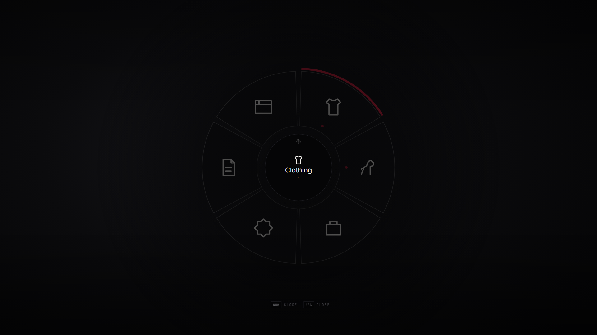

<!--
    lxr-radial — LXRCore action wheel
    Developer: iBoss21 / LXRCore · https://www.lxrcore.com
    © 2026 iBoss21 / LXRCore | lxrcore.com | All Rights Reserved
-->


# lxr-radial — The action wheel for LXRCore v3


Hold **F1** — a ring of what the character can do right now. Clothing (take
off and put on what is worn, undress, dress), the horse, the satchel, duty,
papers, the frame. Rings nest; the wheel changes with the context (on foot,
in the saddle, on a wagon); any resource adds its own entries with one export.
Nothing runs while the key is up.



## The wheel is data

`Config.Wheel` is a list of entries:

```lua
{ id = 'horse', label = 'ring.horse', icon = 'horse', show = { 'onfoot' }, sub = {
    { id = 'horse_call',  label = 'ring.horse_call',  icon = 'whistle', export = { 'lxr-horses', 'CallHorse' } },
    { id = 'horse_store', label = 'ring.horse_store', icon = 'stable',  command = 'horse store' },
} },
{ id = 'papers', label = 'ring.papers', icon = 'paper', serverEvent = 'lxr-radial:server:useItem', args = 'id_card' },
```

An entry does one of: `sub` (a ring), `event`, `serverEvent`, `command`,
`export = { resource, fn, args }`, or `dynamic = 'clothing'` (built on open
from lxr-clothing's `Wearing()`; each worn category toggles through
`ToggleCategory`). When **lxr-clothingradial** is running, the *Clothing* entry
hands over to that wheel instead of opening a ring here. `show` limits it to contexts. Labels are locale keys or text;
icons are names from `html/app.js` `ICONS` (the wardrobe categories are all
there).

## Other resources

```lua
exports['lxr-radial']:Add({ id = 'lasso', label = 'Lasso', icon = 'rope', show = { 'mounted' }, event = 'lxr-lasso:client:ready' })
exports['lxr-radial']:Remove('lasso')
exports['lxr-radial']:Open() / Close() / IsOpen()
```

Entries are dropped when their resource stops.

## Keys

`Config.Key.mapping` (F1) is a key mapping — players rebind it in the game's
settings. `hold = true` keeps the wheel up while the key is held; right mouse
goes back a ring, Esc closes.

## Install

```
ensure lxr-core
ensure lxr-clothing     # for the clothing ring
ensure lxr-radial
ensure lxr-clothingradial   # optional: the clothing wheel takes the Clothing entry
```

Questions, bugs, ideas: [discord.gg/GAhk8cgXe9](https://discord.gg/GAhk8cgXe9)

© 2026 iBoss21 / LXRCore · [lxrcore.com](https://www.lxrcore.com)
